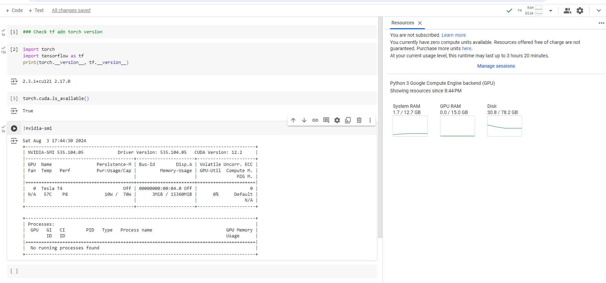

## Установка и настройка рабочего окружения
### Собрать свой docker контейнер для работы с моделями глубокого обучения. 

Сваренный докерфайл -> [Dockerfile](Dockerfile), сам контейнер запускается с помощью [docker compose](docker-compose.yaml).    
Проверка доступности GPU, информация о CPU / GPU и версиях библиотек вот в этом юпитер ноутбуке: [gpu-checker.ipynb](jupyter-data%2Fgpu-checker.ipynb) ( примонтирован и запускался в докер ).

#### Скриншот GPU в колабе

